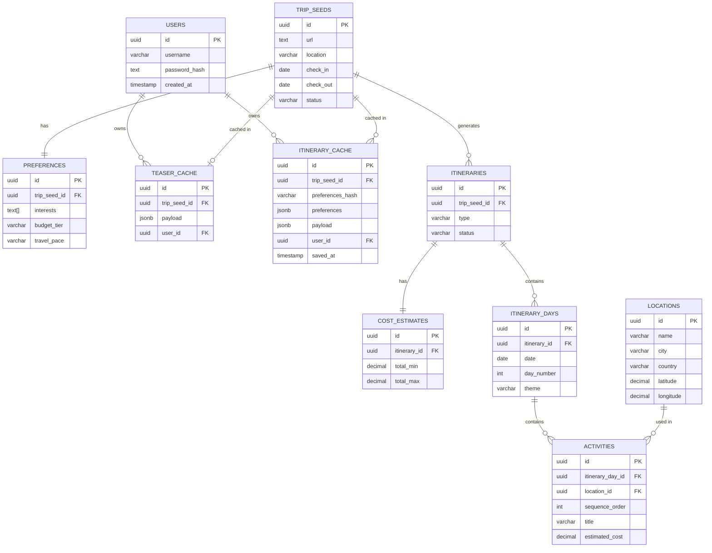

# Entity-Relationship Diagram Notes
## Link2Itinerary

This document contains the ERD for the final implemented schema (9 tables).

---

## Entity-Relationship Diagram (Text)

```
┌──────────────────────┐           ┌──────────────────────┐
│        users         │           │     trip_seeds       │◄──────────────┐
├──────────────────────┤           ├──────────────────────┤      1:1      │
│ PK: id (UUID)        │           │ PK: id (UUID)        │               │
│     username UNIQUE  │           │     url              │  ┌────────────┴────┐
│     password_hash    │           │     summary          │  │  preferences    │
│     created_at       │           │     location         │  ├─────────────────┤
└──────────────────────┘           │     check_in         │  │ PK: id          │
         │                         │     check_out        │  │ FK: trip_seed_id│
         │ 1:N (userId)            │     accommodation    │  │     interests[] │
         ▼                         │     status           │  │     budget_tier │
 ┌───────────────────────────┐     └──────────┬───────────┘  │     pace        │
 │  teaser_cache             │                │              └─────────────────┘
 ├───────────────────────────┤                │
 │ PK: id                    │      ┌─────────┼──────────┐
 │ FK: trip_seed_id (UNIQUE) │      │ 1:1     │          │ 1:N
 │     payload (JSONB)       │◄─────┘         ▼          ▼
 │     user_id (nullable)    │       teaser_cache   itinerary_cache
 │     generated_at          │
 └───────────────────────────┘      ┌──────────────────────┐
                                    │   itinerary_cache    │
 ┌───────────────────────────┐      ├──────────────────────┤
 │  (via user_id)            │      │ PK: id               │
 │  itinerary_cache          │      │ FK: trip_seed_id     │
 ├───────────────────────────┤      │     preferences_hash │
 │ PK: id                    │      │     preferences(JSON)│
 │ FK: trip_seed_id          │      │     payload (JSONB)  │
 │     preferences_hash      │      │     cost_estimate    │
 │     preferences (JSONB)   │      │     user_id (nullable│
 │     payload (JSONB)       │      │     saved_at         │
 │     cost_estimate (JSONB) │      └──────────────────────┘
 │     user_id (nullable)    │
 │     saved_at              │
 └───────────────────────────┘
```

### Core data model (normalized itinerary structure)

```
┌──────────────────────┐           ┌──────────────────────┐
│     trip_seeds       │◄──────────┤    preferences       │
└──────────┬───────────┘    1:1    └──────────────────────┘
           │ 1:N
           ▼
┌──────────────────────┐           ┌──────────────────────┐
│    itineraries       │◄──────────┤   cost_estimates     │
└──────────┬───────────┘    1:1    └──────────────────────┘
           │ 1:N
           ▼
┌──────────────────────┐
│   itinerary_days     │
└──────────┬───────────┘
           │ 1:N
           ▼
┌──────────────────────┐
│     activities       │
└──────────┬───────────┘
           │ N:1
           ▼
┌──────────────────────┐
│     locations        │
└──────────────────────┘
```

---

## Cardinality Summary

| Relationship | Cardinality | Notes |
|--------------|-------------|-------|
| users → teaser_cache | 1:N | userId on cache is nullable (anonymous users allowed) |
| users → itinerary_cache | 1:N | userId on cache is nullable |
| trip_seeds → preferences | 1:1 | One preference set per trip seed |
| trip_seeds → teaser_cache | 1:1 | One cached teaser per trip seed (upsert) |
| trip_seeds → itinerary_cache | 1:N | One row per trip + preferences combination |
| trip_seeds → itineraries | 1:N | Normalized itinerary rows |
| itineraries → cost_estimates | 1:1 | One cost breakdown per itinerary |
| itineraries → itinerary_days | 1:N | Multiple days per itinerary |
| itinerary_days → activities | 1:N | Multiple activities per day |
| locations → activities | 1:N | One location reusable across activities |

---

## Mermaid Diagram


